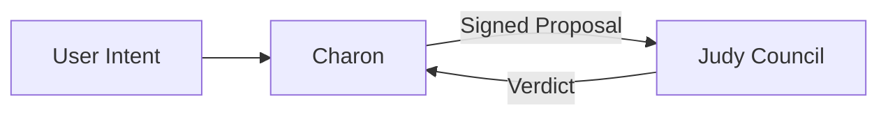

# Charon Agent

Charon is the orchestration agent for the Trophy Backlog Command Center. It transforms user intent into deterministic proposal payloads, signs them, and sends them to Judy Council over gRPC for judgment or commit.

## Architecture Role

- **Zone**: Agent Zone (untrusted orchestration layer)
- **Primary responsibility**: Convert user intent into structured proposal payloads
- **Governance dependency**: Judy Council gRPC (`judy.JudyCouncil`)
- **Security model**: Signed payload envelope, TLS-ready Judy channel, and restricted egress to governance service



## Features

- Deterministic proposal builder for low-cost MVP operation
- Signature envelope (`X-Charon-Signature`) using HMAC-SHA256
- Judge/commit modes through one gRPC method (`ProposeTask`)
- Health and lightweight metrics methods
- Docker and Helm packaging aligned to multi-zone rollout
- Shared governance schema at `proto/judy.proto`

## gRPC API

- Service: `charon.CharonService`
- Method: `Health(google.protobuf.Empty) -> google.protobuf.Struct`
- Method: `GetMetrics(google.protobuf.Empty) -> google.protobuf.Struct`
- Method: `ProposeTask(google.protobuf.Struct) -> google.protobuf.Struct`

### `ProposeTask` Request Body (Struct JSON Shape)

```json
{
	"user_intent": "User confirmed this game is completed",
	"entity_id": "game_204",
	"target_table": "local_backlog",
	"action_type": "UPDATE_STATUS",
	"commit": false
}
```

## Local Run

```bash
docker compose up --build -d
```

Charon listens on `localhost:50051` (gRPC).

## Tests

```bash
docker compose run --rm charon pytest
```

## Configuration

| Variable | Description | Default |
| --- | --- | --- |
| `SERVICE_NAME` | Service identifier | `charon-agent` |
| `SERVICE_VERSION` | Version string | `0.1.0` |
| `CHARON_AGENT_ID` | Agent identifier in metadata | `charon-v1` |
| `GRPC_PORT` | gRPC listen port | `50051` |
| `JUDY_GRPC_TARGET` | Judy Council gRPC target | `judy-council:50052` |
| `JUDY_TIMEOUT_SECONDS` | gRPC timeout to Judy | `10` |
| `JUDY_GRPC_TLS_ENABLED` | Enable TLS for Judy gRPC channel | `false` |
| `JUDY_GRPC_CA_PATH` | CA certificate path for Judy TLS | `/etc/charon/tls/ca.crt` |
| `CHARON_SIGNATURE_SECRET` | Shared secret for proposal signing | `charon-dev-secret` |
| `CHARON_SIGNATURE_HEADER` | Signature header name | `X-Charon-Signature` |

## Kubernetes / Helm

A starter chart is provided at `charts/charon` with:

- Deployment
- ServiceAccount
- Service (gRPC)
- Secret
- Egress NetworkPolicy (allow to Judy only)
- Optional CA secret mount for Judy TLS

Install example:

```bash
helm upgrade --install charon charts/charon -n agent-zone --create-namespace
```

### k3d Quick Deploy

For local k3d deployment with image build/import and Helm install:

```powershell
./scripts/deploy-k3d.ps1
```

Optional overrides:

```powershell
./scripts/deploy-k3d.ps1 -ClusterName trophy-local -Namespace agent-zone -ReleaseName charon -ImageRepository charon-agent -ImageTag latest -JudyNamespace governance-zone
```

## Repository Layout

```text
Charon/
├── app/
│   ├── grpc_server.py
│   ├── judy_client.py
│   ├── orchestrator.py
│   ├── models.py
│   ├── signer.py
│   └── config.py
├── proto/
│   └── judy.proto
├── charts/charon/
├── scripts/
│   └── deploy-k3d.ps1
├── tests/
│   └── test_api.py
├── Dockerfile
├── docker-compose.yml
├── requirements.txt
└── README.md
```
